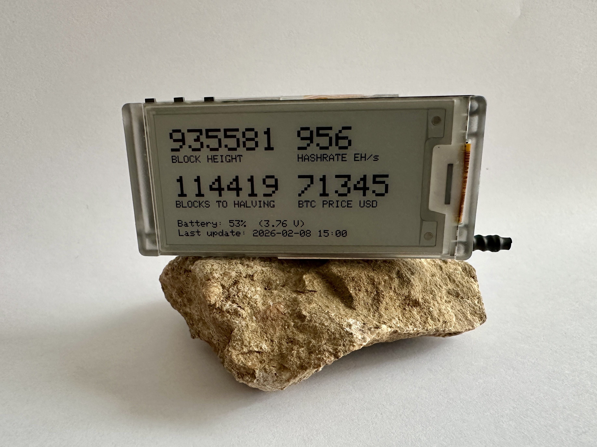
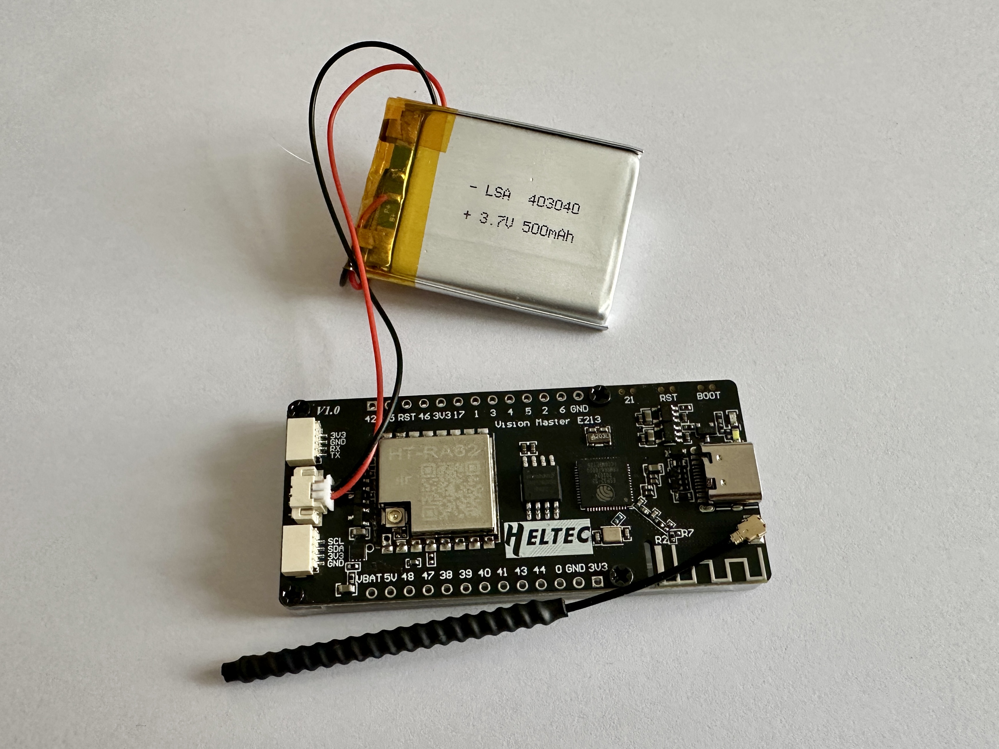

# 🟠 Bitcoin Block Clock - Heltec Vision Master E213

> **Every Bitcoiner should have a block clock. Period.**

A low-power, battery-friendly Bitcoin block clock built on the **Heltec
Vision Master E213** (ESP32-S3 + 2.13" e-ink display).

It connects to your local network via Wi-Fi, pulls Bitcoin data over
MQTT (typically from your own Bitcoin node or Home Assistant), and
displays the most important Bitcoin signals in a calm, always-on way.

------------------------------------------------------------------------

## ✨ Why this exists

Bitcoin is not just a price chart.

It is block height.\
It is deterministic issuance.\
It is halving cycles.\
It is time.

A block clock makes Bitcoin tangible:

-   It shows that Bitcoin keeps moving forward, block by block
-   It grounds you in protocol time, not exchange noise
-   It reminds you that halvings are scheduled - not narratives

You glance at it.\
No apps. No exchanges. No distractions.

------------------------------------------------------------------------

## 🚀 What makes this different

Unlike many commercial block clocks, this one is:

-   **Small** - fits anywhere
-   **Cheap** - off-the-shelf hardware
-   **Customisable** - you control the data and update frequency
-   **Battery powered** - ≈ one week on a 500 mAh LiPo (hourly updates)
-   **Open & hackable** - not a closed ecosystem

------------------------------------------------------------------------

## 📊 What it can display

Depending on your configuration:

-   Block height
-   Blocks remaining to next halving
-   BTC price
-   Network hashrate
-   Battery voltage + estimated %
-   Last update timestamp (YYYY-MM-DD HH:MM)

The display refreshes on a fixed interval (default: once per hour), then
the ESP32 enters deep sleep to conserve power.

------------------------------------------------------------------------

## 🧰 Hardware

-   **Heltec Vision Master E213**\
    ESP32-S3 + 2.13" e-ink display (250×122)
    👉 [Buy here](https://heltec.org/project/vision-master-e213/)

-   **3.7 V LiPo battery (JST connector)**\
    Tested with 500 mAh → \~1 week runtime with hourly updates

No additional hardware required.

------------------------------------------------------------------------

## 👤 Who is this for?

-   Bitcoiners who want a physical representation of Bitcoin time
-   People running their own Bitcoin node
-   Builders who prefer open systems
-   Anyone who finds commercial block clocks:
    -   too expensive
    -   too large
    -   too closed / not customisable

You decide:

-   What data is shown
-   How often it updates
-   Whether price is included

------------------------------------------------------------------------

## 🧠 Learnings & Design Decisions

### 1️⃣ Real-time updates are not worth it on battery

Frequent updates (e.g. every 10 minutes) drain the battery quickly while
adding little real value.

Bitcoin does not change meaningfully at minute-by-minute human scale.

Updating once per hour gives:

-   Excellent battery life
-   A device that still feels alive
-   Alignment with Bitcoin's slow, steady nature

With a 500 mAh battery, runtime is roughly one week.

------------------------------------------------------------------------

### 2️⃣ Price still matters

Block height and halving progress are fundamental.

But whether someone has been in Bitcoin for 1 year or 13 years -
people still care about price.

Including BTC price keeps the device relevant as a daily reference
point.

------------------------------------------------------------------------

### 3️⃣ Raw aesthetics are intentional

-   No enclosure (yet)
-   No animations
-   No glossy UI

Function first. Polish later.

------------------------------------------------------------------------

## 🏗 Software Architecture

-   ESP32 connects to Wi-Fi
-   Subscribes to MQTT topics on your local network
-   Data typically published from Bitcoin Core via Python or Home
    Assistant
-   Display updates on fixed interval → deep sleep

### Default MQTT topics

    home/bitcoin/height
    home/bitcoin/halving/blocks_remaining
    home/bitcoin/price_usd
    home/bitcoin/hashrate_ehs

Use retained MQTT messages so the device always receives the latest
values after waking.

------------------------------------------------------------------------

## 🔐 Configuration & Secrets

Wi-Fi and MQTT credentials are **not committed** to the repository.

Create a local file:

    secrets.h

Example template:

``` cpp
static const char* WIFI_SSID     = "YOUR_WIFI_NAME";
static const char* WIFI_PASS     = "YOUR_WIFI_PASSWORD";

static const char* MQTT_SERVER   = "192.168.1.144";
static const int   MQTT_PORT     = 1883;
static const char* MQTT_USER     = "mqtt";
static const char* MQTT_PASS     = "mqtt";
```

`secrets.h` is ignored via `.gitignore`.

`secrets.example.h` file in provided in the repository.

------------------------------------------------------------------------

## 🔋 Update Interval

Battery life is directly controlled by the update interval.

In the main sketch:

``` cpp
static const uint32_t UPDATE_INTERVAL_MINUTES = 60;
```

Examples:

-   `10` → frequent updates, short battery life
-   `30` → compromise
-   `60` → recommended (\~1 week on 500 mAh)

------------------------------------------------------------------------

## 📸 Photos

\
\
\
\


------------------------------------------------------------------------

## 🔮 Future Ideas

-   Simple enclosure / 3D printed case
-   Partial e-ink refresh optimisation
-   Solar trickle charging
-   More Bitcoin-native metrics
-   Multi-screen rotation mode

------------------------------------------------------------------------

## 📜 License

MIT

------------------------------------------------------------------------

🟠 If you build one, fork it, improve it, and make it yours.
